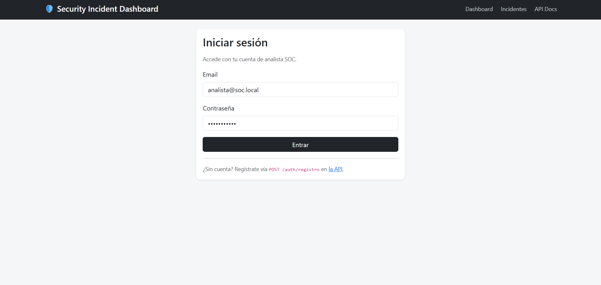
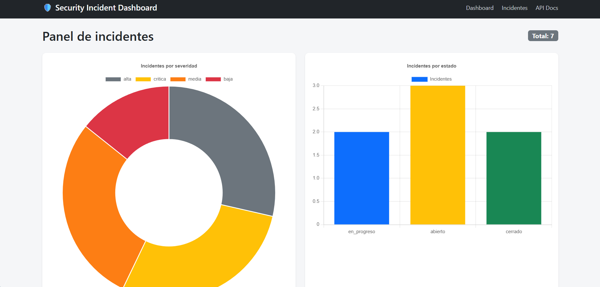
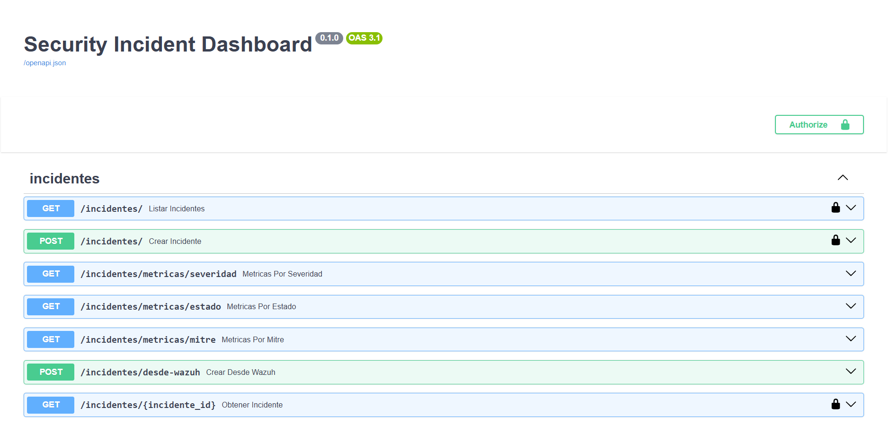
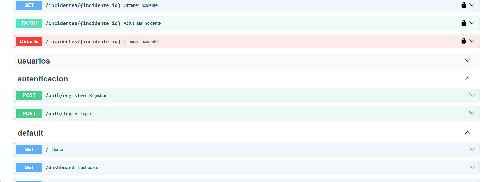
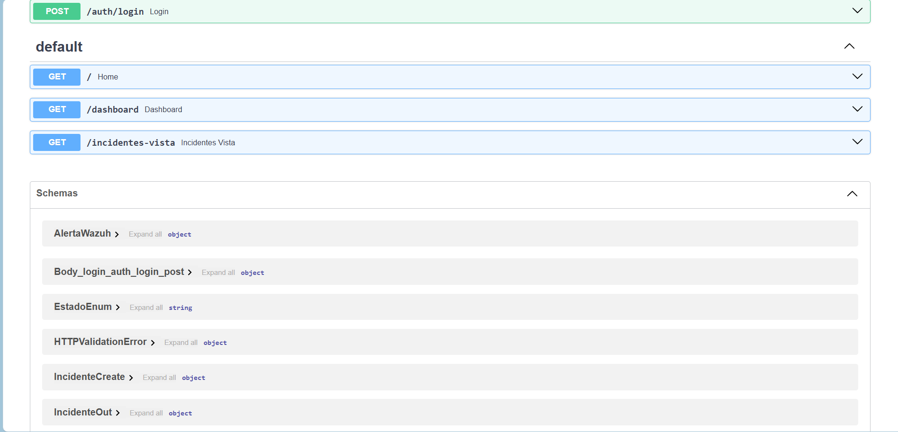

# 🛡️ Security Incident Dashboard

Aplicación Full Stack para gestión de incidentes de seguridad: registro, clasificación por severidad, seguimiento de estado y métricas visuales — mapeado a técnicas MITRE ATT&CK.

## 🎯 Objetivo
Sistema de gestión de incidentes de seguridad que permite a un equipo SOC (Security Operations Center) registrar, clasificar y dar seguimiento a alertas, con métricas visuales de severidad, estado y técnicas MITRE. Demuestra un stack de desarrollo Full Stack moderno aplicado a un caso de uso de ciberseguridad.

## 🔧 Stack tecnológico
- **Backend:** FastAPI + SQLAlchemy
- **Base de datos:** MySQL 8
- **Autenticación:** JWT (OAuth2 Password Flow)
- **Frontend:** Jinja2 (SSR) + Bootstrap 5 + Chart.js
- **Infraestructura:** Docker + Docker Compose + Microsoft Azure
- **Documentación de API:** OpenAPI / Swagger (automática en /docs)

## 🚀 Cómo ejecutarlo

### Opción A — Docker (recomendada, todo incluido)
```bash
git clone https://github.com/AlejandroCuestaR/security-incident-dashboard.git
cd security-incident-dashboard
cp .env.example .env
docker compose up --build
```

Visita:
- http://localhost:8000/ — pantalla de login
- http://localhost:8000/dashboard — dashboard con métricas
- http://localhost:8000/docs — documentación interactiva (Swagger)

### Opción B — Local sin Docker
```bash
python -m venv venv
source venv/bin/activate
pip install -r requirements.txt
cp .env.example .env
uvicorn app.main:app --reload
```

### Primer uso
1. Registra un usuario: POST /auth/registro
2. Login: POST /auth/login → copia el access_token
3. En Swagger pulsa Authorize y pega el token
4. Crea incidentes con POST /incidentes/
5. (Opcional) carga datos de ejemplo: python seed.py

## 📊 Funcionalidades
- CRUD completo de incidentes (crear, listar, obtener, actualizar, eliminar)
- Autenticación JWT con usuarios y roles
- Dashboard con métricas por severidad y estado (Chart.js)
- Endpoints de métricas adicionales por técnica MITRE
- Integración con Wazuh (POST /incidentes/desde-wazuh)
- Documentación automática OpenAPI / Swagger

## 📸 Capturas

### Login


### Dashboard


### Documentación Swagger




## 📚 Documentación detallada
| Doc | Contenido |
|---|---|
| [00-introduccion](docs/00-introduccion.md) | Propósito y arquitectura |
| [01-modelo-datos](docs/01-modelo-datos.md) | Tablas, relaciones y diagrama ER |
| [02-backend-api](docs/02-backend-api.md) | Endpoints y patrón de diseño |
| [03-autenticacion](docs/03-autenticacion.md) | Flujo JWT y buenas prácticas |
| [04-frontend](docs/04-frontend.md) | Jinja2 + Bootstrap (SSR) |
| [05-dashboard-metricas](docs/05-dashboard-metricas.md) | Métricas y Chart.js |
| [06-docker](docs/06-docker.md) | Dockerización |
| [07-despliegue-azure](docs/07-despliegue-azure.md) | Despliegue en Azure |

## 📁 Estructura del repositorio
\`\`\`
security-incident-dashboard/
├── README.md
├── seed.py
├── docs/
├── app/
│   ├── main.py
│   ├── models.py
│   ├── schemas.py
│   ├── database.py
│   ├── auth.py
│   ├── routers/
│   ├── templates/
│   └── static/css/
├── Dockerfile
├── docker-compose.yml
├── requirements.txt
├── .env.example
└── capturas/
\`\`\`

## 👤 Autor
**Alejandro Cuesta Rodríguez** — Ingeniero en Sistemas Computacionales
[LinkedIn](https://www.linkedin.com/in/alejandro-cuesta-rodriguez-5044723a7) | [GitHub](https://github.com/AlejandroCuestaR)
